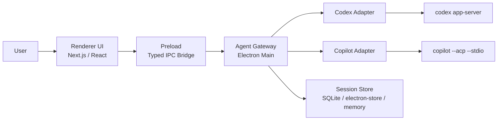

# Architecture

## 1. この文書の目的

この文書は、[001-solution.md](./discussion/001-solution.md) を実装可能な設計指針へ落とし込むためのアーキテクチャ定義である。対象は「複数コーディングエージェントを同一 UI から扱えるか」を検証する PoC であり、完成度の高い PR レビュー製品を設計するものではない。

本 PoC の最優先事項は次の 6 点である。

- UI から provider 固有プロトコルを隠蔽できること
- `cwd` を指定してセッション開始できること
- 同一セッションで継続会話できること
- アプリ再起動後も recent sessions から会話を再開できること
- 実行中イベントとテキスト断片をストリーミング表示できること
- structured response と rich text response を同じアプリで描画できること

## 2. 設計原則

- 最小境界を先に決める。機能追加より先に、責務の置き場所を明確にする。
- 共通化は capability ベースで行う。無理に provider 差分を消し込まない。
- Renderer は UI と表示状態に集中し、プロトコル吸収は main 側へ寄せる。
- Provider ごとの差異は Adapter に閉じ込める。Gateway は「アプリ内イベント」へ正規化する。
- structured response と rich text response は別物として扱い、片方をもう片方へ無理に寄せない。
- PoC では provider の実測結果を設計仮説より優先する。仮説と実装観測が食い違った場合は、実装を基準に文書を更新する。
- PoC では検証速度のために一時的な緩さを許容してよい。ただし、その緩さが本番方針ではない場合は文書上で明示的に区別する。
- review 機能と GitHub 連携は後回しにし、永続化は session resume に必要な最小限へ絞る。

## 3. 全体像



### 3-1. 依存方向

- Renderer は `shared/domain` と preload 経由の IPC API にだけ依存する
- Preload は Electron IPC の橋渡しだけを担当する
- Agent Gateway は Renderer に依存しない
- Provider Adapter は Gateway が定義した Port を実装する
- Provider Adapter はそれぞれの CLI / App Server 仕様に依存してよい
- 永続化は Gateway の内側に置き、UI や Adapter から直接触れさせない

## 4. 各層の責務分割

### 4-1. Presentation / UI 層

主な配置候補:

- `renderer/pages`
- `renderer/components`
- `renderer/features`

責務:

- エージェント選択、`cwd` 選択、プロンプト入力
- セッション一覧、会話履歴、ステータス表示
- recent sessions と再開可能セッションの表示
- ストリーミング中テキストの描画
- structured response / rich text response の表示切り替え
- capability に応じた操作ボタンの表示制御

責務ではないこと:

- child process の起動
- provider ごとの RPC / ACP 通信
- provider 固有イベントの解釈
- 永続化方式の選定

### 4-2. IPC / Preload 境界

主な配置候補:

- `main/preload.ts`
- `main/ipc/*`

責務:

- Renderer に公開する安全な API の定義
- 送受信イベント名と payload 型の固定
- Electron 固有 API を Renderer から隠蔽する
- PoC 中は検証を止めないための限定的な escape hatch を、一時的に許容してよい

責務ではないこと:

- セッション管理
- 業務ロジック
- provider 差分吸収
- 汎用 bridge を前提にした恒常的な機能設計

運用メモ:

- typed API を原則とする
- `window.ipc` のような汎用 bridge は、PoC 中の実験・移行・デバッグ用途に限定する
- 本番開発では use case 単位の typed API に収束させる

### 4-3. Agent Gateway 層

主な配置候補:

- `main/agent-gateway/*`
- `main/application/*`

責務:

- `AppSession` の生成、再取得、破棄
- 起動時の session 復元と recent sessions の提供
- Renderer からの command を Provider Adapter 呼び出しへ変換
- Provider イベントを共通 `AgentEvent` へ正規化
- capability 情報の公開
- 権限要求、エラー、進行状態の中継
- `ResultEnvelope` をセッション状態へ反映する
- native resume と app-side rehydrate の戦略選択
- 必要最小限の永続化

責務ではないこと:

- UI の描画判断
- provider プロセスごとの詳細プロトコル実装
- provider ごとの parse / schema 分岐の保持
- PR レビュー専用の複雑なドメイン判定

### 4-4. Provider Adapter 層

主な配置候補:

- `main/agent-runtime/codex/*`
- `main/agent-runtime/copilot/*`

責務:

- provider プロセスの起動と停止
- provider ごとの session id と app session id の対応付け
- native resume を持つ provider では read / resume を実装する
- provider 独自イベントの購読
- provider のレスポンスから final text や structured candidate を抽出する
- `shared/domain` の parser / normalizer を用いて structured output を確定する、または擬似実現する
- Gateway が扱える粒度の `RuntimeSessionEvent` へ変換する

責務ではないこと:

- UI フレンドリーな状態管理
- 画面都合のイベント加工
- 他 provider との共通仕様の強制

### 4-5. Shared Domain 層

主な配置候補:

- `shared/domain/*`
- `shared/contracts/*`

責務:

- `AgentKind`、`AgentCapability`、`AgentEvent` などの共通型
- `AppSession`、`ConversationTurn`、`ResultEnvelope` などのドメインモデル
- IPC payload と validation のための型定義

責務ではないこと:

- Electron 実装
- provider SDK への直接依存

## 5. コア部分の実装方針

### 5-1. セッションはアプリ都合の ID を主キーにする

provider の session id をそのまま UI に見せない。Gateway は `appSessionId` を発行し、内部で `providerSessionId` と関連付ける。これにより、Renderer は provider 差分を意識せずに会話を継続できる。

```ts
type AgentKind = "codex" | "copilot";

interface AgentSessionHandle {
  agent: AgentKind;
  appSessionId: string;
  providerSessionId: string;
  cwd: string;
}
```

### 5-2. 機能差は capability で公開する

Codex と Copilot は非対称である。共通 API は最小化し、追加機能は capability の有無で UI と Gateway が判断する。

```ts
type AgentCapability =
  | "nativeResumeSession"
  | "nativeForkSession"
  | "nativeSteerActiveTurn"
  | "structuredOutput"
  | "nativeReview";
```

判断例:

- `nativeForkSession` がなければ UI に fork 操作を出さない
- `structuredOutput` がなければ JSON 指示 + Normalizer の経路を使う
- `nativeSteerActiveTurn` がなければ実行中の追加指示は出さない
- `nativeResumeSession` は provider-native resume がある場合だけ公開する

追加ルール:

- capability は UI / IPC / Gateway / Runtime まで end-to-end で到達している機能だけを公開する
- 将来予定の機能は capability ではなく、Phase や TODO として管理する
- `nativeResumeSession` は「アプリとして会話を再開できること」ではなく、「provider が保存済み session/thread を直接 resume できること」を意味する

会話再開の扱い:

- UI のユースケースとしては `continueConversation` を共通で持つ
- provider が `nativeResumeSession` を持つ場合は native resume を優先する
- provider が `nativeResumeSession` を持たない場合は、Gateway が保存済み履歴または resume summary を使って app-side rehydrate を行う
- これにより、再開 UX は共通に保ちつつ provider 差分は main 側へ閉じ込める

### 5-3. イベントは最小セットへ正規化する

PoC では provider ごとのイベントをそのまま渡さず、次のような最小イベントへ寄せる。

```ts
type AgentEvent =
  | { type: "session.started"; appSessionId: string; agent: AgentKind }
  | {
      type: "session.capabilities";
      appSessionId: string;
      capabilities: AgentCapability[];
    }
  | { type: "status.changed"; appSessionId: string; status: AgentStatus }
  | {
      type: "message.delta";
      appSessionId: string;
      messageId: string;
      text: string;
    }
  | { type: "message.completed"; appSessionId: string; messageId: string }
  | { type: "result.structured"; appSessionId: string; data: unknown }
  | {
      type: "result.richText";
      appSessionId: string;
      format: "markdown";
      content: string;
    }
  | {
      type: "permission.requested";
      appSessionId: string;
      requestId: string;
      payload: unknown;
    }
  | { type: "error"; appSessionId: string; error: AppError };
```

設計意図:

- Renderer が provider 固有イベントを知らずに済む
- 後から別 provider を追加しても UI 変更点を局所化できる
- レビュー専用イベントを早期導入せず、PoC 判断を単純化できる

### 5-4. structured response は 2 経路で扱う

- Codex: `outputSchema` を使う。ただし現行の `codex app-server` では、native structured object が別フィールドで返らず、最終回答に JSON text として現れる場合がある。そのため現時点では、`outputSchema` で制約された JSON text を抽出し、`shared/domain` の parser / normalizer で structured result として採用する
- Copilot: JSON 出力指示 + parser / validation / normalizer で擬似的に structured output を構成する

共通ルール:

- structured 変換は UI に届く前に main 側で完了させる
- 実装上の既定責務は「Adapter が provider 差分を吸収し、`shared/domain` の parser / normalizer を使い、Gateway が `ResultEnvelope` を状態へ反映する」である
- UI は `ResultEnvelope` の種類で描画モードを切り替える
- structured の検証に失敗した場合は rich text へフォールバックする
- 将来 Codex が native structured object を安定して返すようになった場合は、その payload を優先採用する
- PR レビュー専用 schema は PoC 時点では固定しない

### 5-5. ストリーミングと最終結果は別レーンで保持する

`message.delta` は暫定表示用であり、最終結果の canonical data ではない。Gateway または Renderer の state では、次の 2 つを分離して持つ。

- 実行中に増えていく `streamBuffer`
- 完了後に確定する `finalResult`

これにより、stream の断片と structured result を無理に同一オブジェクトへ混在させずに済む。

### 5-6. 権限要求は Gateway で中継する

権限要求は provider 実装に依存するが、UI へは共通 `permission.requested` として流す。PoC では権限 UI の完成度より、「要求が来たことを UI で認識し、許可・拒否を返せる」ことを優先する。

### 5-7. 永続化は hybrid に寄せて薄く始める

PoC でも session persistence / resume は scope に含める。ただし、保存対象は「再開 UX を成立させる最小限」に絞る。推奨方針は、アプリ側 store を canonical な UI 復元元にしつつ、provider 側 session/thread id は外部参照として保持する hybrid 方式である。

保存対象の最小単位:

- `appSessionId`
- `agent`
- `providerSessionId` または `threadId`
- `cwd`
- モデルや主要設定の snapshot
- recent sessions 用の summary
- 最後に描画した final result
- resume に必要な turn 履歴または compaction 済み summary

provider ごとの扱い:

- Codex: 保存済み `threadId` を使って read / resume を試みる
- Copilot ACP: native resume を前提にせず、保存済み履歴または summary から新しい provider session を再構成する

ストア候補:

- PoC 初期は `electron-store`
- 会話履歴が増える段階で SQLite へ移行、または併用する

### 5-8. 実行制御は単純に保つ

PoC 段階では 1 セッションにつき同時に 1 つの active turn を前提とする。複数 turn の同時実行、複雑な queue 管理、細かなキャンセル戦略は後回しにする。

## 6. ドメインモデル

### 6-1. 主要モデル

| モデル | 役割 | 主な属性 | 備考 |
| --- | --- | --- | --- |
| `AgentProvider` | 利用する provider の識別 | `kind`, `displayName`, `capabilities` | `codex`, `copilot` を想定 |
| `WorkspaceContext` | 実行対象ワークスペース | `cwd`, `label` | セッション開始時に固定 |
| `AppSession` | UI から見た会話単位 | `appSessionId`, `agent`, `cwd`, `status` | アプリ再起動後も同じ会話として復元される論理主キー |
| `ProviderSessionRef` | provider 側セッション参照 | `providerSessionId`, `agent`, `resumeStrategy` | UI へ直接露出しない |
| `ConversationTurn` | ユーザー送信と agent 応答の 1 往復 | `turnId`, `prompt`, `startedAt`, `completedAt` | active turn は 1 つまで |
| `StreamBuffer` | 途中経過の表示 | `messageId`, `chunks[]` | rich text の暫定描画用 |
| `ResultEnvelope` | 完了後の最終結果 | `kind`, `structuredData`, `richText` | 描画の切り替え単位 |
| `PermissionRequest` | 実行中の確認要求 | `requestId`, `sessionId`, `payload`, `status` | Gateway で中継 |
| `AppError` | UI に返す失敗情報 | `code`, `message`, `retryable`, `details` | provider 依存エラーを隠蔽 |

### 6-2. ResultEnvelope の考え方

```ts
type ResultEnvelope =
  | {
      kind: "structured";
      schemaName: string;
      data: unknown;
      fallbackRichText?: string;
    }
  | {
      kind: "richText";
      format: "markdown";
      content: string;
    };
```

ルール:

- Renderer は `kind` を起点に描画を切り替える
- structured の妥当性検証と fallback 判定は UI 到達前に main 側で完了させる
- 実装上は Adapter + `shared/domain` が変換責務を持ち、Gateway は確定済み `ResultEnvelope` を canonical data として扱う
- fallback は renderer の救済表示専用に使う

### 6-3. 状態モデル

```ts
type AgentStatus =
  | "idle"
  | "starting"
  | "running"
  | "waiting_permission"
  | "completed"
  | "failed";
```

状態遷移の原則:

- `starting` から直接 `failed` に落ちてもよい
- `running` 中は `message.delta` が複数回届く
- `completed` 到達時点で `finalResult` が確定し、そのまま follow-up を受け付ける待機状態を兼ねる
- `waiting_permission` は再度 `running` へ戻りうる

## 7. 推奨ディレクトリ方針

PoC 時点では monorepo 化しない。現在の Nextron 構成を生かしながら、責務で切る。

```text
main/
  agent-gateway/
    application/
    services/
  agent-runtime/
    codex/
    copilot/
  ipc/
  preload.ts
shared/
  domain/
  contracts/
renderer/
  pages/
  components/
  features/
  hooks/
```

分離判断の基準:

- 2 つ以上の desktop shell から共有したくなったときに `packages/*` を検討する
- 現段階ではファイル分割より責務分割を優先する

## 8. やらないこと

### 8-1. PR レビュー専用ドメインの先行設計

やらない理由:

- Diff、inline comment、re-review を先に入れると、agent 統合そのものの検証がぼやける
- Codex / Copilot 間の差分より GitHub 連携実装が支配的になる

### 8-2. Provider 機能の完全対称化

やらない理由:

- Copilot と Codex は利用可能機能が異なる
- 共通最小公倍数に合わせると Codex の強みを捨て、逆に Codex 基準で寄せると Copilot 実装が不自然になる

### 8-3. 完成形の永続化と監査ログ

やらない理由:

- PoC で必要なのは recent sessions と会話再開であり、全文検索や監査証跡の完成ではない
- 先に完全な DB スキーマを固定すると、会話モデルや result モデルの試行錯誤を阻害する

### 8-4. shell 非依存の完成形抽象化

やらない理由:

- 現時点の関心は Electron 上で境界が適切に切れるかである
- Tauri / Electrobun への移行可能性は「UI が provider へ直接依存しない」ことを確保すれば十分に担保できる

### 8-5. 複雑な並列制御

やらない理由:

- まず確認したいのは 1 セッション 1 active turn での成立性である
- turn queue、複数 concurrent turn、差し込み制御は PoC を超える複雑性を持つ

## 9. 実装フェーズとの対応

### Phase 1

- Gateway と Adapter の骨格を作る
- Codex / Copilot の rich text streaming を通す
- `cwd` 指定と session start を通す

### Phase 2

- `ResultEnvelope` を導入する
- Codex `outputSchema` を組み込む
- Copilot の validation / Normalizer を組み込む

### Phase 3

- session persistence / continueConversation を追加する
- provider-native resume と app-side rehydrate の分岐を入れる
- 必要最小限の永続化を入れる

### Phase 4

- Codex `thread/fork` と `turn/steer` を追加する
- permission mediation を追加する
- capability 表示を end-to-end 実装範囲へ揃える

### Phase 5

- review 的ユースケースを追加するかを再判断する
- 必要なら review 専用の別ドメイン層を追加する

## 10. この設計で判断できること

このアーキテクチャで検証したいのは、次の問いに Yes と答えられるかである。

- UI は provider 差分を意識せずに会話体験を提供できるか
- Provider Adapter の追加が Gateway と UI の小変更で済むか
- app-side persistence と provider 参照の併用で、再起動後も会話を継続できるか
- structured response と rich text response を同じ会話基盤の上で扱えるか
- Codex 固有機能を capability ベースで安全に露出できるか

Yes であれば、この PoC は当初のミッションを満たす。
