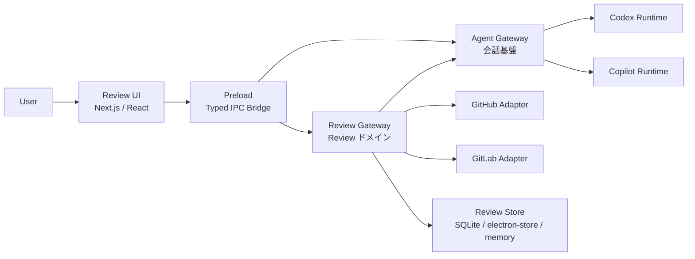

# Architecture - Review Assistant

## 1. この文書の目的

この文書は、PoC 第二弾である PR / MR レビュー支援アプリのアーキテクチャ定義である。第一弾が会話基盤と provider 差分吸収を主眼にしていたのに対し、本書は review 固有の境界を追加しつつ、既存の `AgentGateway` を壊さずに拡張することを目的とする。

本 PoC の最優先事項は次の点である。

- 実データの PR / MR を読めること
- review 草案をローカル thread として描画できること
- 指摘ごとに独立した会話を持てること
- 投稿前承認を挟んで実投稿できること
- Codex / Copilot の差を UI から隠蔽しつつ、必要な capability は露出できること

## 2. 設計原則

- 第一弾の会話基盤は再利用する。review 専用の状態を `AgentGateway` に混ぜない。
- review 固有の責務は `ReviewGateway` 配下に寄せる。会話実行と review ドメインは分離する。
- UI は raw provider data を知らず、正規化済み snapshot と result だけを扱う。
- ローカル草案と実投稿は別物として扱う。UI では混在させない。
- capability ベースで差分を公開する。Codex / Copilot の非対称性を無理に揃えない。
- structured response と rich text response は別レーンで扱い、片方へ強制変換しない。

## 3. 全体像



### 3-1. 依存方向

- Renderer は review の正規化済みデータだけを見る
- Preload は typed IPC の橋渡しだけを担当する
- `AgentGateway` は review とは独立して会話を管理する
- `ReviewGateway` は source fetch、diff 正規化、thread 管理、投稿前承認を担当する
- Provider Adapter は provider の API 差分を隠蔽する

## 4. 層の責務分割

### 4-1. Presentation / UI 層

責務:

- provider と review source の選択
- diff / discussion / local thread の表示
- review summary と draft panel の描画
- thread reply と投稿前承認の導線
- review lens の切り替え

責務ではないこと:

- GitHub / GitLab API の直接呼び出し
- review 用 session の作成戦略の判断
- provider 差分の解釈

### 4-2. Agent Gateway 層

既存の `AgentGateway` は次を担当する。

- `AppSession` の生成、再取得、破棄
- Codex / Copilot の会話実行
- stream、permission、structured result の中継
- fork、steer、resume の provider 差分吸収

review 支援 PoC では、`AgentGateway` に review 固有の分岐を追加しない。
review 文脈の会話が必要な場合でも、`AgentGateway` はあくまで会話の runtime 層に留める。

### 4-3. Review Gateway 層

`ReviewGateway` は review ドメインのオーケストレーションを担う。内部は次の責務に分ける。

- `ReviewSourceAdapter`
- `ReviewContextAssembler`
- `ReviewRunCoordinator`
- `ThreadSessionRegistry`
- `PublishCoordinator`
- `ReviewLensRegistry`

### 4-4. Provider Adapter 層

provider ごとの API 差分は次の層に閉じ込める。

- GitHub REST / GraphQL
- GitLab REST
- PR / MR の差分、discussion、anchor、投稿 payload の差分

### 4-5. Shared Domain 層

共通型は `shared/domain` に置く。

- `ReviewSnapshot`
- `ReviewFinding`
- `ReviewSummary`
- `ReviewThreadDraft`
- `ReviewPublishRequest`
- `ReviewLens`
- `ReviewThreadBinding`

## 5. review 境界のコア設計

### 5-1. 実データは Snapshot に正規化する

`ReviewSourceAdapter` は GitHub / GitLab から取得した raw response を `ReviewSnapshot` に変換する。

```ts
interface ReviewSnapshot {
  provider: 'github' | 'gitlab';
  reviewId: string;
  title: string;
  description: string;
  baseSha: string;
  headSha: string;
  files: ReviewSnapshotFile[];
  discussions: ReviewSnapshotThread[];
  providerContext: {
    anchorRefs: Record<string, unknown>;
  };
}
```

`ReviewSnapshot` には後続の投稿に必要な anchor 情報を含める。これがないと local draft から実投稿に変換できない。

### 5-2. レビュー文脈は Assembler で作る

`ReviewContextAssembler` は snapshot から agent 向けの review context を生成する。

責務:

- レビュー対象の要約
- file ごとの重要差分の抽出
- 既存 discussion の圧縮
- lens ごとの prompt 生成
- thread 単位の継続文脈作成

### 5-3. AI 実行は Coordinator に寄せる

`ReviewRunCoordinator` は review 実行の進行を管理する。

責務:

- root review session の開始
- 総評と指摘一覧の取得
- structured output の validation
- rich text への fallback
- local thread draft への反映

### 5-4. thread 単位の session を Registry で管理する

`ThreadSessionRegistry` は指摘ごとの会話分岐を管理する。

```ts
interface ReviewThreadBinding {
  reviewId: string;
  threadId: string;
  rootAppSessionId: string;
  discussionAppSessionId: string;
  strategy: 'codex-fork' | 'app-side-rehydrate';
}
```

方針:

- Codex は capability があれば fork を優先する
- Copilot は native fork を前提にせず app-side rehydrate を使う
- thread ごとに context を分離し、レビュー全体の文脈肥大を避ける

### 5-5. 投稿は PublishCoordinator で分離する

`PublishCoordinator` は local draft から実投稿への変換を扱う。

責務:

- local thread 草案の検証
- 投稿 payload の組み立て
- ユーザー承認の結果反映
- GitHub / GitLab への実コメント投稿
- 失敗時の draft 保持

local draft と remote comment は同じ thread に見えても、内部モデルは分離する。

### 5-6. 観点追加は Lens Registry で扱う

`ReviewLensRegistry` は観点別レビューを差し替えるための入口とする。

例:

- `general`
- `tests`
- `docs`
- `breaking-change`

各 lens は prompt、schema、result renderer を切り替えられる。

## 6. ドメインモデル

### 6-1. 主要モデル

| モデル | 役割 | 主な属性 | 備考 |
| --- | --- | --- | --- |
| `ReviewSnapshot` | PR / MR の正規化済み実体 | `provider`, `reviewId`, `baseSha`, `headSha`, `files`, `discussions` | UI と agent の共通入力 |
| `ReviewFinding` | エージェントの指摘 1 件 | `findingId`, `severity`, `title`, `body`, `anchor` | local thread の元データ |
| `ReviewSummary` | 総評と要約 | `headline`, `overview`, `riskNotes` | summary panel 用 |
| `ReviewThreadDraft` | 投稿前草案 | `threadId`, `draftBody`, `anchor`, `status` | local と remote を分離 |
| `ReviewThreadBinding` | thread と session の対応 | `threadId`, `rootAppSessionId`, `discussionAppSessionId` | thread ごとに分離 |
| `ReviewPublishRequest` | 実投稿要求 | `provider`, `reviewId`, `drafts[]` | 承認後に使用 |
| `ReviewLens` | 観点定義 | `lensId`, `promptTemplate`, `schemaName` | 後付け拡張用 |

### 6-2. Review result の考え方

```ts
type ReviewResultEnvelope =
  | {
      kind: 'summary-and-findings';
      summary: ReviewSummary;
      findings: ReviewFinding[];
      source: 'codexOutputSchema' | 'promptedJson';
      fallbackRichText?: string;
    }
  | {
      kind: 'richText';
      format: 'markdown';
      content: string;
    };
```

ルール:

- `summary` と `findings` は別々の表示レーンで扱う
- structured 変換に失敗した場合は rich text へ落とす
- UI は provider ごとの parse 分岐を持たない

### 6-3. 状態モデル

```ts
type ReviewStatus =
  | 'idle'
  | 'loading_source'
  | 'drafting_review'
  | 'showing_local_threads'
  | 'awaiting_approval'
  | 'publishing'
  | 'completed'
  | 'failed';
```

状態遷移の原則:

- source 読込と review 実行は別フェーズに分ける
- local thread 作成後に初めて approval を要求する
- `publishing` は短時間の遷移状態として扱う

## 7. 永続化方針

PoC では永続化を薄く始める。保存対象は次の最小単位でよい。

- `reviewId`
- `provider`
- `baseSha`
- `headSha`
- `snapshot`
- `summary`
- `findings`
- `thread bindings`
- `draft payloads`
- `publish status`

推奨方針:

- アプリ側 store を canonical な UI 復元元にする
- GitHub / GitLab の remote id は外部参照として保持する
- review session は session store で復元できるようにする

ストア候補:

- PoC 初期は `electron-store`
- データが増えたら SQLite を併用する

## 8. 実装フェーズとの対応

### Phase 1

- `ReviewSourceAdapter` と `ReviewSnapshot` を作る
- GitHub / GitLab の実データを `/mr` へ接続する

### Phase 2

- `ReviewContextAssembler` と `ReviewRunCoordinator` を作る
- 総評と findings の structured output を通す

### Phase 3

- `ThreadSessionRegistry` を追加する
- Codex fork と Copilot app-side rehydrate を分岐する

### Phase 4

- `PublishCoordinator` を追加する
- local draft から実コメント投稿までを通す

### Phase 5

- `ReviewLensRegistry` を追加する
- tests / docs などの観点別レビューを追加する

## 9. やらないこと

### 9-1. Diff 更新後の完全自動追従

やらない理由:

- diff 更新時の thread 再マッピングは複雑で、PoC の主眼をぼかす

### 9-2. 実投稿と local draft の同一視

やらない理由:

- 承認前に remote comment を作ると、UI の安全性と説明可能性が落ちる

### 9-3. Provider 完全対称化

やらない理由:

- Codex と Copilot は持てる capability が異なる
- 共通化しすぎると双方の強みを潰す

### 9-4. 完全な監査ログと権限制御

やらない理由:

- PoC では導線確認が目的であり、運用統制の完成度は主目的ではない

### 9-5. レビュー万能モデルの先行設計

やらない理由:

- lens を増やす前に、1 つの review pipeline が end-to-end で成立することが重要である

## 10. この設計で判断できること

このアーキテクチャで検証したいのは、次の問いに Yes と答えられるかである。

- UI は provider 差分を意識せずにレビュー支援を提供できるか
- `AgentGateway` を壊さずに review 専用の境界を足せるか
- local thread と remote comment を安全に分離できるか
- Codex fork と Copilot app-side rehydrate を同じ thread 体験にまとめられるか
- review Lens を後付けで増やせるか

Yes であれば、この PoC 第二弾は当初のミッションを満たす。
